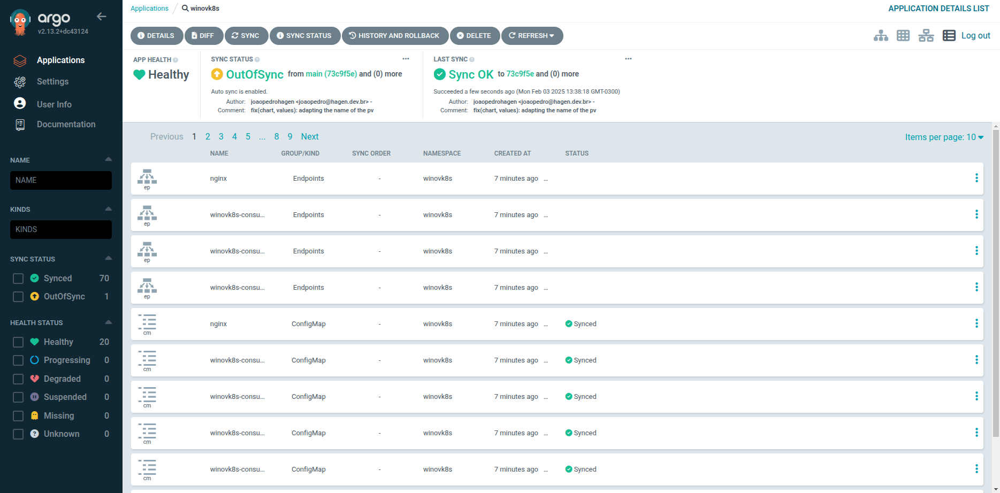
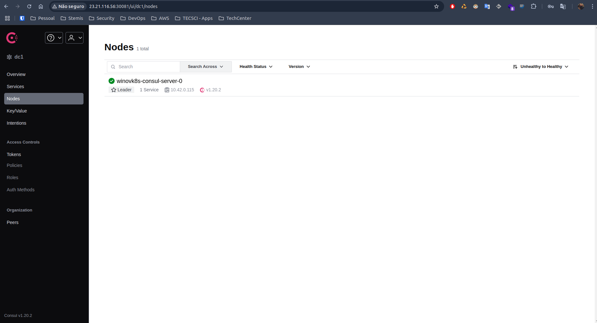
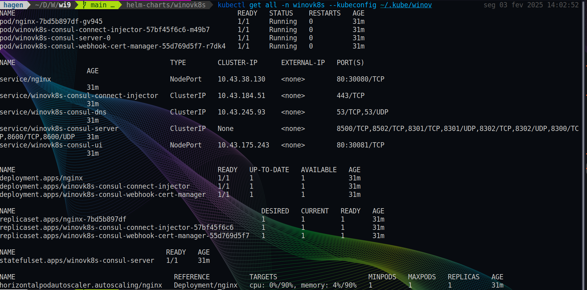
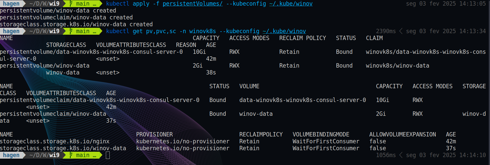
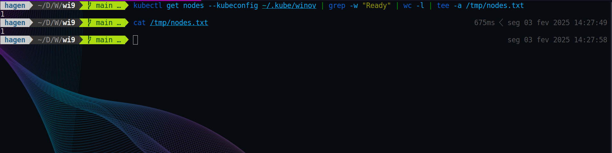

# WinovK8s
Cluster para avaliação. Todos os arquivos utilizados para provisionar os recursos estão neste repositório.

## Como o ambiente foi provisionado

Provisionei o ambiente na AWS utilizando o terraform. Você pode clicar [aqui](https://github.com/joaopedrohagen/wi9/blob/main/terraform/main.tf) para ir até o arquivo `main.tf` do repositório.

Após provisionar a instância, criei o cluster através do RKE. O arquivo de configuração está disponível [aqui](https://github.com/joaopedrohagen/wi9/blob/main/rke/cluster.yml).


## Questões

1. Os recursos foram provisionados utilizando o Helm Charts junto ao ArgoCD. O Chart em questão foi feito por mim com a depêndencia do Chart do Consul. O Chart está disponível nessa [pasta](https://github.com/joaopedrohagen/wi9/tree/main/helm-charts/winovk8s), já a Application do ArgoCD está disponível [aqui](https://github.com/joaopedrohagen/wi9/blob/main/application.yaml).

* O comando utilizando para provisionar o ArgoCD foi este:
```shell
kubectl apply -n argocd -f https://raw.githubusercontent.com/argoproj/argo-cd/stable/manifests/install.yaml --kubeconfig ~/.kube/winov
```

* Após a criação do ArgoCD, eu apliquei a Application dele com esse comando:
```shell
kubectl apply -f application.yaml --kubeconfig ~/.kube/winov
```



> A aplicação do Consul está disponível no IP `23.21.116.56` na porta `30081`. Como o ambiente é controlado e isolado das minhas demais aplicações, decidi liberar o acesso por um determinado tempo antes de eu dar um `terraform destroy` 🤗.


* Esses foram os recursos instalados com o meu Chart:



2. Com o volume persistente eu decidi fazer da forma tradicional. Criei os manifestos e os apliquei usando o `kubectl`.

> Os manifestos estão [aqui](https://github.com/joaopedrohagen/wi9/tree/main/persistentVolumes).

* Essas são os comandos e suas saídas:



3. Peguei os Nodes que estão como Ready no Cluster e redirecionei para o arquivo /tmp/nodes.txt, conforme pedido.

* Utilizei esse comando:
```shell
kubectl get nodes --kubeconfig ~/.kube/winov | grep -w "Ready" | wc -l | tee -a /tmp/nodes.txt
```

* Aqui está o print da tela:



4. Não possuo experiência com Kubernetes em Bare Metal, porém possuo vasto conhecimento em Kubernetes e muita facilidade em aprender. Possuo experiência em ferramentas como Kustomize, Helm Chart, ArgoCD, EKS, dentre outras.

5. Verificaria os enventos do namespace do ingress, ordenando por timestamp, para tentar descobrir o que pode ter ocorrido. Verificaria de o DaemonSet ou o Deployment dele ainda existe. Olharia os últimos commits do repositório, caso utilizem alguma ferramenta de CI/CD para ver se teve alguma alteração que possa ter deletado o controller. Recuperar o manifesto do controller e aplicá-lo e verificar os Ingresses para validar se estão todos funcionando corretamente. Se estivesse usando um LB, verificaria se ele ainda está associado ao LB correto.

---

Pessoal, espero ter atendido à todas as questões que foram solicitadas. Quaisquer dúvidas, estou à disposição. É um imenso prazer participar desse processo com vocês! 😉

